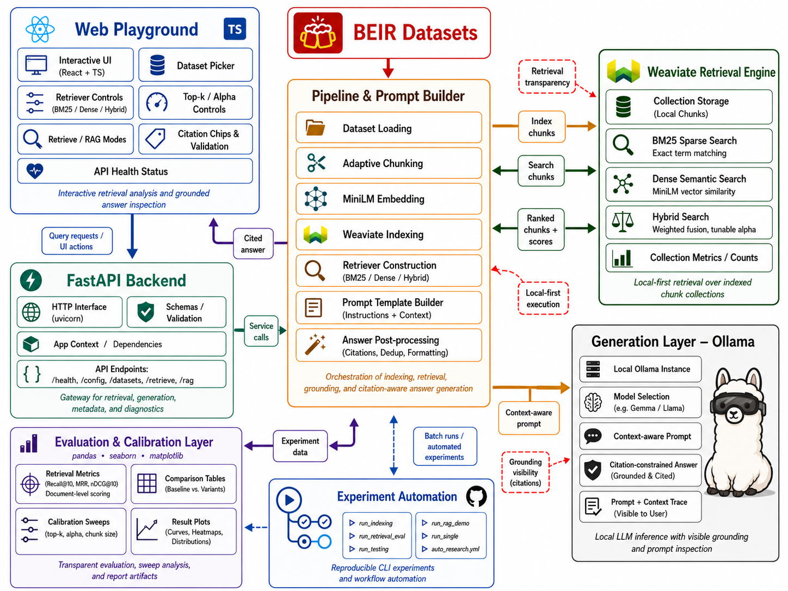

<div align="center">

<h1>
  Hybrid RAG 🚀<br>
  Sparse to Dense Embeddings Playground
</h1>

**A local-first RAG playground for comparing BM25, dense MiniLM retrieval, hybrid fusion, and citation-aware Ollama generation on BEIR datasets.**

</div>
<p align="center">
  <a href="#quickstart"></a>
  <a href="#architecture"></a>
  <a href="#retrieval-modes"></a>
  <a href="#experiments"></a>
</p>

<p align="center">
  
  
  
  
  
  
</p>

<p align="center">
  <a href="#overview"><b>Overview</b></a> ·
  <a href="#architecture"><b>Architecture</b></a> ·
  <a href="#quickstart"><b>Quickstart</b></a> ·
  <a href="#retrieval-modes"><b>Retrieval</b></a> ·
  <a href="#rag-and-citations"><b>RAG & Citations</b></a> ·
  <a href="#experiments"><b>Experiments</b></a> ·
  <a href="#web-playground"><b>Web Playground</b></a> ·
  <a href="#api"><b>API</b></a> ·
  <a href="#configuration"><b>Configuration</b></a> ·
  <a href="#troubleshooting"><b>Troubleshooting</b></a>
</p>

</div>

---

## :sparkles: Overview

Hybrid RAG is a compact RAG system built for one practical reason: it lets you see what happened before the answer was generated.

Most RAG demos show the final response and hide the interesting parts. This project keeps the useful debugging signals visible: which chunks were retrieved, how they were scored, which document they came from, what prompt was sent to the model, which citations the model used, and whether those citations were actually available in the retrieved context.

The stack is local by default:

- Weaviate stores chunked documents and serves BM25, dense, and hybrid retrieval.
- MiniLM embeddings provide the dense retrieval signal.
- Ollama runs the generation model locally.
- FastAPI exposes the retrieval and RAG endpoints.
- A React playground gives you a browser view over ranking, prompts, answers, and citations.
- Experiment scripts produce repeatable retrieval metrics and saved traces.

> [!NOTE]
> This repository is not trying to be a one-line `ask()` abstraction. It is closer to a workbench: useful when you want to inspect, compare, and tune a RAG pipeline instead of hoping the answer is grounded.

A normal development pass looks something like this:

1. Index a small dataset, usually `scifact` first.
2. Compare BM25, dense, and hybrid results for the same query.
3. Check whether relevant evidence appears in the top-k chunks.
4. Inspect the prompt that is sent to Ollama.
5. Generate an answer and verify that citations match real retrieved chunk IDs.
6. Run retrieval metrics before trusting qualitative RAG examples.
7. Save the configuration next to any metrics you care about.

### Why the project exists

RAG failures are often hard to spot. A fluent answer can be unsupported. A citation can look real while pointing to a chunk that was never retrieved. A dense retriever can return text that sounds related but does not contain the needed evidence. A BM25 result can score highly because of term overlap while missing the actual claim.

This project makes those cases easier to catch. It does not replace careful evaluation, but it gives you the pieces needed to do it properly.

---

## :package: What is included

The repository combines a runnable application with experiment tooling. That is intentional. The same retrieval code can be used from the CLI, the API, or the web playground.

**Indexing path.** Documents are loaded from BEIR-style datasets, split into chunks, embedded with MiniLM, and written to Weaviate with chunk IDs, document IDs, titles or metadata, text, and vectors.

**Retrieval path.** Queries can be executed with BM25, dense search, or hybrid fusion. The same `top_k` and `alpha` controls are available from scripts and from the UI.

**Generation path.** Retrieved chunks are formatted into a prompt, sent to an Ollama model, and returned with citation diagnostics.

**Evaluation path.** Retrieval runs can be scored with Recall@10, MRR, and nDCG@10. RAG demos can save prompts, retrieved chunks, answers, and citation checks.

A good first local configuration is:

```text
dataset       = scifact
model         = gemma2:2b
chunk_size    = 512
overlap       = 64
top_k         = 10
hybrid alpha  = 0.5
embedding     = sentence-transformers/all-MiniLM-L6-v2
```

> [!IMPORTANT]
> Treat these as starting values, not universal defaults. The real source of truth should be the YAML files in `configs/`.

---

## :building_construction: Architecture

<div align="center">
  
  <br>
  <sub><b>Figure 1.</b> Local-first retrieval, evaluation, automation, and citation-aware generation.</sub>
</div>

The architecture is split so that each failure can be traced to a specific layer. If a final answer is bad, the problem is not automatically “the LLM.” It may be the dataset selection, chunking, embedding model, retriever mode, `top_k`, prompt format, citation parser, or the generation settings.

### Main components

| Component | What it does |
|---|---|
| BEIR loader | Reads corpus, queries, and qrels for benchmark-style retrieval experiments. |
| Chunking pipeline | Converts documents into smaller evidence units that can be ranked and cited. |
| MiniLM embedding step | Creates dense vectors used by semantic and hybrid retrieval. |
| Weaviate | Stores chunk text, metadata, vectors, and supports BM25/dense/hybrid search. |
| Retriever wrapper | Gives BM25, dense, and hybrid retrieval a common interface. |
| Prompt builder | Turns retrieved chunks into a context block with citation instructions. |
| Ollama client | Sends the grounded prompt to a local model. |
| Citation validator | Checks whether generated citations match retrieved chunk IDs. |
| Experiment runners | Rebuild indexes, score retrieval, run sweeps, and save traces. |
| Web playground | Makes retrieval, prompts, answers, and citation checks visible. |

The key design choice is to keep retrieval and generation separate. You should be able to run retrieval alone, inspect the chunks, and decide whether the generator has enough evidence before asking the model to answer.

> [!TIP]
> Debug from left to right. Dataset and index first, retriever second, prompt third, model last.

---

## :rocket: Quickstart

This setup starts the local services and runs a small end-to-end test. Commands are hidden so the README stays readable.

### 1. Check requirements

You need Python, Docker, Ollama, Bun, and Git. Use Python `3.10+` and Docker Compose V2.

<details>
<summary><b>Show validation commands</b></summary>

```bash
python --version
docker --version
docker compose version
ollama --version
bun --version
git --version
```

</details>

> [!WARNING]
> Start with one small dataset. Indexing every dataset before the stack is validated makes debugging slower and usually does not teach you anything useful.

### 2. Clone the repository

<details>
<summary><b>Show clone commands</b></summary>

```bash
git clone <your-repository-url>
cd <your-repository-name>
```

</details>

All commands below assume you are in the repository root.

### 3. Create the Python environment

Use a virtual environment for the backend, evaluation scripts, Weaviate client, embedding packages, and plotting tools.

<details>
<summary><b>Show Python environment commands</b></summary>

```bash
python -m venv .venv
```

Linux or macOS:

```bash
source .venv/bin/activate
```

Windows PowerShell:

```powershell
.venv\Scripts\Activate.ps1
```

Upgrade packaging tools:

```bash
python -m pip install --upgrade pip setuptools wheel
```

</details>

If later commands cannot import project modules, check that the environment is activated and that the package was installed in editable mode.

### 4. Install backend dependencies

<details>
<summary><b>Show installation commands</b></summary>

```bash
pip install -e ".[dev]"
```

If the project does not define a `dev` extra:

```bash
pip install -e .
```

</details>

After this step, experiment modules should run from the repository root with `python -m src.experiments...`.

### 5. Start Weaviate

Weaviate must be running before indexing and retrieval.

<details>
<summary><b>Show Weaviate commands</b></summary>

```bash
docker compose -f docker/docker-compose.yml up -d
```

Check the container:

```bash
docker compose -f docker/docker-compose.yml ps
```

Check readiness:

```bash
curl -s http://localhost:8080/v1/.well-known/ready
```

Expected output:

```text
true
```

</details>

> [!CAUTION]
> Use `--recreate` only when you intentionally want to rebuild the index. It can delete the existing collection for that dataset or configuration.

### 6. Start Ollama and pull a model

The examples use `gemma2:2b` because it is small enough for local testing. For stronger answer quality, use the model configured in `configs/rag.yaml`.

<details>
<summary><b>Show Ollama commands</b></summary>

Start Ollama if needed:

```bash
ollama serve
```

In another terminal:

```bash
ollama pull gemma2:2b
ollama list
```

</details>

> [!IMPORTANT]
> The model name must match exactly. `gemma2:2b` and `gemma2` are different model names for Ollama.

### 7. Check configuration before indexing

Before writing chunks to Weaviate, open the config files and check the active dataset, chunking settings, embedding model, collection name, retriever defaults, and Ollama model.

<details>
<summary><b>Show configuration inspection commands</b></summary>

```bash
ls configs
```

```bash
cat configs/datasets.yaml
cat configs/retrieval.yaml
cat configs/rag.yaml
cat configs/sweep.yaml
```

</details>

The first run should be boring. Use `scifact`, `top_k=10`, `alpha=0.5`, and a moderate chunk size such as `512`. Once that works, change one variable at a time.

### 8. Index one dataset

Indexing creates chunk objects in Weaviate. A useful chunk object should contain at least a chunk ID, source document ID, text, and metadata. Dense retrieval also requires the embedding vector.

<details>
<summary><b>Show indexing commands</b></summary>

Run default indexing:

```bash
python -m src.experiments.run_indexing
```

Index only SciFact:

```bash
python -m src.experiments.run_indexing --dataset scifact
```

Re-index SciFact with a specific chunk size:

```bash
python -m src.experiments.run_indexing --dataset scifact --chunk-size 512 --recreate
```

</details>

What should happen on rerun depends on the implementation, but it should be explicit: skip existing data, append safely, or fail clearly. Silent duplicate insertion is a bug worth fixing.

### 9. Run retrieval evaluation

Do this before spending time on generation. If relevant documents do not appear in the retrieved set, the model cannot cite them.

<details>
<summary><b>Show retrieval evaluation commands</b></summary>

Run default evaluation:

```bash
python -m src.experiments.run_retrieval_eval
```

Evaluate a balanced hybrid setup:

```bash
python -m src.experiments.run_retrieval_eval --dataset scifact --top-k 10 --alpha 0.5
```

</details>

A useful first result is a side-by-side comparison of BM25, dense, and hybrid retrieval on the same dataset and `top_k`.

### 10. Run one RAG trace

A single detailed trace is better than a large demo when debugging. It should expose the query, retrieved chunks, scores, prompt, answer, citations, and invalid citations.

<details>
<summary><b>Show RAG trace commands</b></summary>

```bash
python -m src.experiments.run_single --dataset scifact --top-k 5 --alpha 0.5
```

Run the demo set:

```bash
python -m src.experiments.run_rag_demo
```

</details>

A good trace should answer five questions: was the right evidence retrieved, were chunk IDs visible in the prompt, did the model copy valid IDs, did the answer add unsupported claims, and did validation catch bad citations?

### 11. Start the API

<details>
<summary><b>Show FastAPI commands</b></summary>

```bash
./run_api.sh
```

Open:

```text
http://localhost:8000/docs
```

Health check:

```bash
curl -s http://localhost:8000/api/health
```

</details>

Keep this terminal open while using the frontend. The logs are usually the quickest way to spot schema mismatches, missing collections, or Ollama connection failures.

### 12. Start the web playground

<details>
<summary><b>Show web commands</b></summary>

```bash
cd web
bun install
bun run dev
```

Open:

```text
http://localhost:5173
```

</details>

Start with the health panel, then dataset selection, then retrieve mode. Run RAG only after the retrieved chunks look reasonable.

---

## :mag: Retrieval modes

The three retrieval modes are useful for different failure cases.

### BM25

BM25 is the lexical baseline. It works well when the query shares terms with the evidence: entities, acronyms, paper-specific wording, scientific claims, error codes, identifiers, and exact phrases. It is also the easiest mode to reason about. If a term is not in the chunk, BM25 cannot match it.

### Dense MiniLM retrieval

Dense retrieval compares embeddings rather than exact tokens. It can find paraphrases and related wording, which helps when the query and document do not use the same phrasing.

The weakness is precision. Dense retrieval can return chunks that are “about the same topic” without containing the exact evidence needed for the answer.

### Hybrid retrieval

Hybrid retrieval combines sparse and dense signals. The `alpha` value controls the balance:

```text
alpha = 0.0  -> mostly BM25
alpha = 0.5  -> balanced sparse + dense
alpha = 1.0  -> mostly dense
```

A sensible tuning order is:

1. Compare BM25, dense, and hybrid at the same `top_k`.
2. Sweep `alpha` while keeping the index fixed.
3. Increase `top_k` if relevant chunks exist but are ranked too low.
4. Change chunk size only when chunks are clearly too small or too broad.

> [!NOTE]
> There is no universal best `alpha`. Scientific claim datasets often benefit from stronger lexical evidence, while paraphrased questions may need more dense retrieval.

---

## :memo: RAG and citations

Citation support only matters if citations are tied to real retrieved chunks. This project treats citation checking as part of the response, not as decoration.

### Retrieved context example

```text
[chunk_id: scifact:doc_1397:chunk_0]
title: Example scientific claim document
score: 0.8124
text: The trial reported no statistically significant association between treatment X and outcome Y...

[chunk_id: scifact:doc_2411:chunk_2]
title: Related evidence document
score: 0.7741
text: A later meta-analysis found that the effect was inconsistent across cohorts...
```

### Prompt skeleton

```text
You are a retrieval-grounded assistant.

Use only the evidence in CONTEXT.
Cite factual claims with chunk IDs in square brackets.
If the evidence is insufficient, say that it is insufficient.
Do not invent citations.

QUESTION:
{query}

CONTEXT:
{context_block}

ANSWER:
```

### Valid cited answer

```text
The available evidence does not support a strong association between treatment X and outcome Y. One trial reported no statistically significant association [scifact:doc_1397:chunk_0], and a later meta-analysis found inconsistent effects across cohorts [scifact:doc_2411:chunk_2].
```

### Invalid citation example

```text
[scifact:doc_9999:chunk_7]
```

If that ID was not in the retrieved context for the current request, the validator should flag it. It may look like a citation, but it is not grounded.

> [!WARNING]
> Citation validation does not prove the full answer is true. It only proves whether the cited IDs were available to the model. You still need to inspect whether each claim is actually supported by the cited chunk.

---

## :test_tube: Experiments

The experiment scripts keep evaluation from becoming “I tried a few questions and it looked good.” Use the UI for inspection, but use scripts for comparisons.

### Runners

- `run_indexing` builds or rebuilds dataset indexes.
- `run_retrieval_eval` scores retrieval with qrels.
- `run_testing` runs calibration sweeps.
- `run_rag_demo` saves example RAG traces.
- `run_single` prints one detailed trace for debugging.

<details>
<summary><b>Show experiment commands</b></summary>

```bash
python -m src.experiments.run_indexing
python -m src.experiments.run_retrieval_eval
python -m src.experiments.run_testing
python -m src.experiments.run_rag_demo
python -m src.experiments.run_single
```

</details>

<details>
<summary><b>Show common variants</b></summary>

```bash
# Index one dataset
python -m src.experiments.run_indexing --dataset scifact

# Re-index with a custom chunk size
python -m src.experiments.run_indexing --dataset scifact --chunk-size 512 --recreate

# Evaluate hybrid retrieval
python -m src.experiments.run_retrieval_eval --dataset scifact --top-k 10 --alpha 0.5

# Skip chunk-size sweeps when tuning only alpha/top-k
python -m src.experiments.run_testing --skip-chunk

# Print one detailed trace
python -m src.experiments.run_single --dataset scifact --top-k 5 --alpha 0.5
```

</details>

### Metrics that matter first

**Recall@10** tells you whether relevant documents are appearing in the top ten. If this is low, generation will usually fail for the right reason: missing evidence.

**MRR** tells you how early the first relevant result appears. This matters when prompts only include a few chunks.

**nDCG@10** is the best quick view of ranking quality because it rewards useful evidence near the top.

> [!IMPORTANT]
> If retrieval is chunk-level but qrels are document-level, map chunk IDs back to document IDs before scoring. Otherwise one document split into many chunks can make metrics look better than they are.

### Recommended evaluation order

Start small:

1. Index `scifact`.
2. Run BM25, dense, and hybrid at `top_k=10`.
3. Inspect a few failed queries with `run_single`.
4. Sweep `alpha`: `0.0`, `0.25`, `0.5`, `0.75`, `1.0`.
5. Try chunk sizes such as `256`, `512`, and `768` only after retrieval failures suggest chunking is the issue.
6. Run RAG demos after retrieval looks acceptable.

---

## :computer: Web playground

The playground is for debugging, not only for demos.

Use it in this order:

1. Check health status.
2. Select an indexed dataset.
3. Run retrieve mode with BM25, dense, and hybrid.
4. Compare chunk text, scores, document IDs, and duplicates.
5. Open the prompt viewer.
6. Run RAG mode.
7. Check citation chips and validation warnings.

<details>
<summary><b>Show web startup commands</b></summary>

```bash
./run_api.sh
cd web
bun install
bun run dev
```

</details>

A useful UI trace should make the same query reproducible from the CLI or API. If the UI only shows the final answer, it is hiding the most important part of RAG debugging.

---

## :zap: API

The API sits between the frontend, experiment scripts, Weaviate, and Ollama.

| Method | Endpoint | Purpose |
|---|---|---|
| `GET` | `/api/health` | Check backend dependency status. |
| `GET` | `/api/config` | Return runtime options and frontend defaults. |
| `GET` | `/api/datasets` | List datasets and indexed chunk counts. |
| `POST` | `/api/retrieve` | Run BM25, dense, or hybrid retrieval. |
| `POST` | `/api/rag` | Retrieve evidence, build prompt, generate answer, validate citations. |

<details>
<summary><b>Show API docs URL</b></summary>

```text
http://localhost:8000/docs
```

</details>

### Example retrieval request

<details>
<summary><b>Show JSON request</b></summary>

```json
{
  "dataset": "scifact",
  "query": "Does the evidence support the scientific claim?",
  "mode": "hybrid",
  "top_k": 10,
  "alpha": 0.5
}
```

</details>

### Example RAG response shape

<details>
<summary><b>Show JSON response shape</b></summary>

```json
{
  "answer": "The answer text with [scifact:doc_1397:chunk_0] citations.",
  "chunks": [
    {
      "chunk_id": "scifact:doc_1397:chunk_0",
      "document_id": "doc_1397",
      "title": "Example scientific claim document",
      "score": 0.8124,
      "text": "Retrieved evidence text..."
    }
  ],
  "citations": [
    {
      "chunk_id": "scifact:doc_1397:chunk_0",
      "valid": true
    }
  ],
  "diagnostics": {
    "mode": "hybrid",
    "top_k": 10,
    "alpha": 0.5,
    "invalid_citations": []
  }
}
```

</details>

> [!NOTE]
> The live FastAPI docs are the source of truth if the schema changes.

---

## :bar_chart: Results and artifacts

Expected outputs should be predictable enough to compare across runs:

- `data/results/retrieval_metrics.csv`
- `images/retrieval_comparison_table.md`
- `images/retrieval_comparison_table.csv`
- `data/results/rag/rag_demo.json`
- `images/rag_demo.md`
- `data/results/sweep_results.csv`
- `images/sweep_ndcg10.png`

When saving an important result, keep the run context with it:

```text
dataset=scifact
retriever=hybrid
top_k=10
alpha=0.5
chunk_size=512
overlap=64
embedding_model=sentence-transformers/all-MiniLM-L6-v2
ollama_model=gemma2:2b
collection=<configured collection name>
```

> [!CAUTION]
> Do not compare metrics from different index states as if they were the same experiment. Changing chunk size, overlap, embedding model, or collection schema changes the retrieval problem.

---

## :gear: Configuration

Configuration belongs in YAML, not scattered through scripts.

### `configs/datasets.yaml`

Use this file for dataset names, splits, and any mapping between local names and BEIR identifiers. Start with one dataset and make sure it appears in `/api/datasets` after indexing.

### `configs/retrieval.yaml`

This is the main file for retrieval behavior. It should make these values explicit:

```yaml
chunking:
  chunk_size: 512
  overlap: 64

embedding:
  model_name: sentence-transformers/all-MiniLM-L6-v2
  batch_size: 32

retrieval:
  default_mode: hybrid
  top_k: 10
  alpha: 0.5
```

### `configs/rag.yaml`

This file should define the Ollama model, prompt template, temperature, and context limits. For citation-aware generation, the prompt must preserve:

```text
{query}
{context_block}
```

### `configs/sweep.yaml`

Keep sweeps small until the baseline works:

```yaml
top_k: [5, 10, 20]
alpha: [0.0, 0.25, 0.5, 0.75, 1.0]
chunk_size: [256, 512, 768]
```

> [!WARNING]
> Alpha and top-k sweeps reuse the same index. Chunk-size sweeps usually require re-indexing.

---

## :wrench: Troubleshooting

### Weaviate is not ready

<details>
<summary><b>Show Weaviate troubleshooting commands</b></summary>

```bash
docker compose -f docker/docker-compose.yml ps
curl -s http://localhost:8080/v1/.well-known/ready
docker compose -f docker/docker-compose.yml restart
```

</details>

Common causes: Docker is stopped, port `8080` is busy, or the collection schema no longer matches the current code/config.

### Ollama is unreachable

<details>
<summary><b>Show Ollama troubleshooting commands</b></summary>

```bash
ollama serve
ollama list
ollama pull gemma2:2b
```

</details>

Check that `configs/rag.yaml` uses exactly the same model name shown by `ollama list`.

### Retrieval returns no chunks

Usually this means the dataset was not indexed, the API points to the wrong collection, the dataset name does not match, or Weaviate was recreated after indexing.

<details>
<summary><b>Show retrieval debugging commands</b></summary>

```bash
python -m src.experiments.run_indexing --dataset scifact
python -m src.experiments.run_single --dataset scifact --top-k 5 --alpha 0.5
curl -s http://localhost:8000/api/datasets
```

</details>

### Citation chips are missing

Check the prompt first. The model cannot cite chunk IDs that were never included in the context block.

A valid citation should look like:

```text
[scifact:doc_1397:chunk_0]
```

If the model uses a different format, either update the prompt or update the parser.

### Evaluation looks too good

Check whether duplicate chunks from the same source document are being counted as separate hits. For BEIR-style qrels, score at document level, not chunk level.

### Embedding is slow

Lower the embedding batch size first. Then reduce enabled datasets. Avoid changing chunk size and batch size at the same time, because that makes the cause of the improvement unclear.

---

## :world_map: Roadmap

- [ ] Add reranking with a cross-encoder or local LLM reranker.
- [ ] Add streaming responses in the web playground.
- [ ] Save full experiment snapshots next to metrics.
- [ ] Add citation faithfulness scoring beyond ID validation.
- [ ] Add dataset metadata filters for constrained retrieval.
- [ ] Add a one-command Docker profile for the full stack.
- [ ] Add richer Markdown or HTML experiment reports.

---

<div align="center">

**Transparent retrieval. Local generation. Reproducible RAG experiments.**

:star: Star the repository if this project helps your work.

</div>
